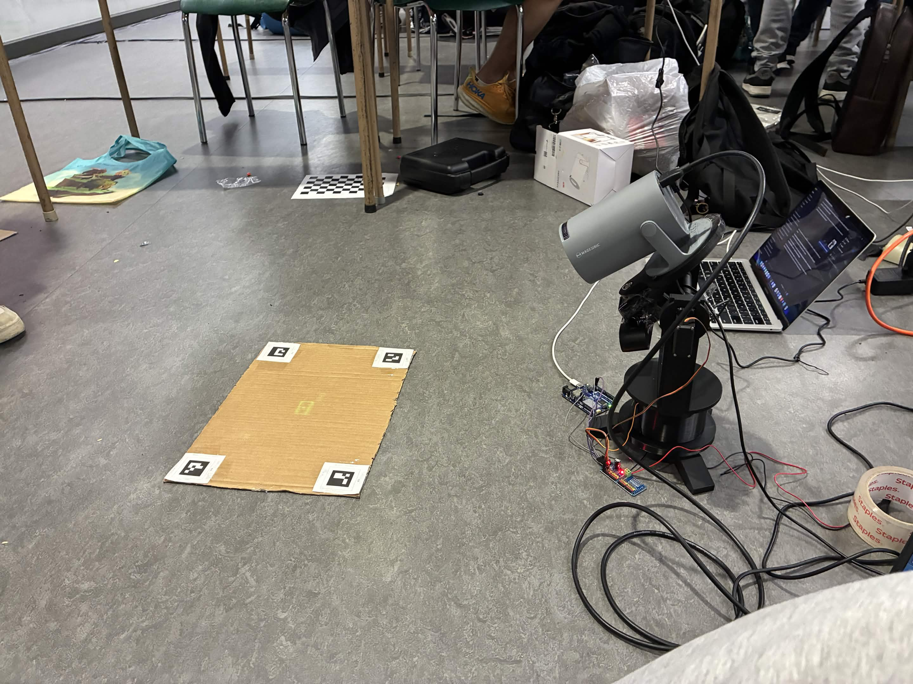
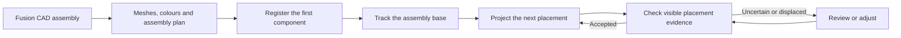
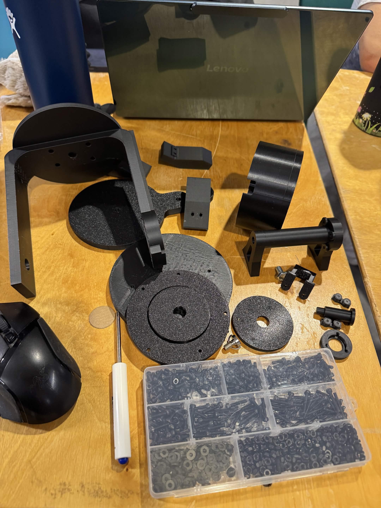
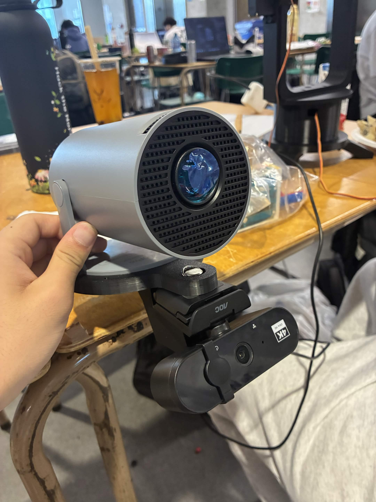
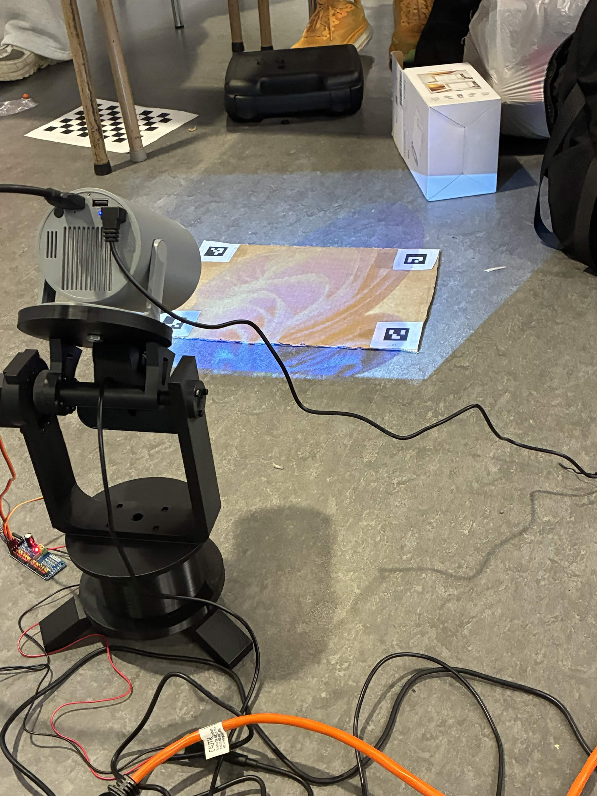
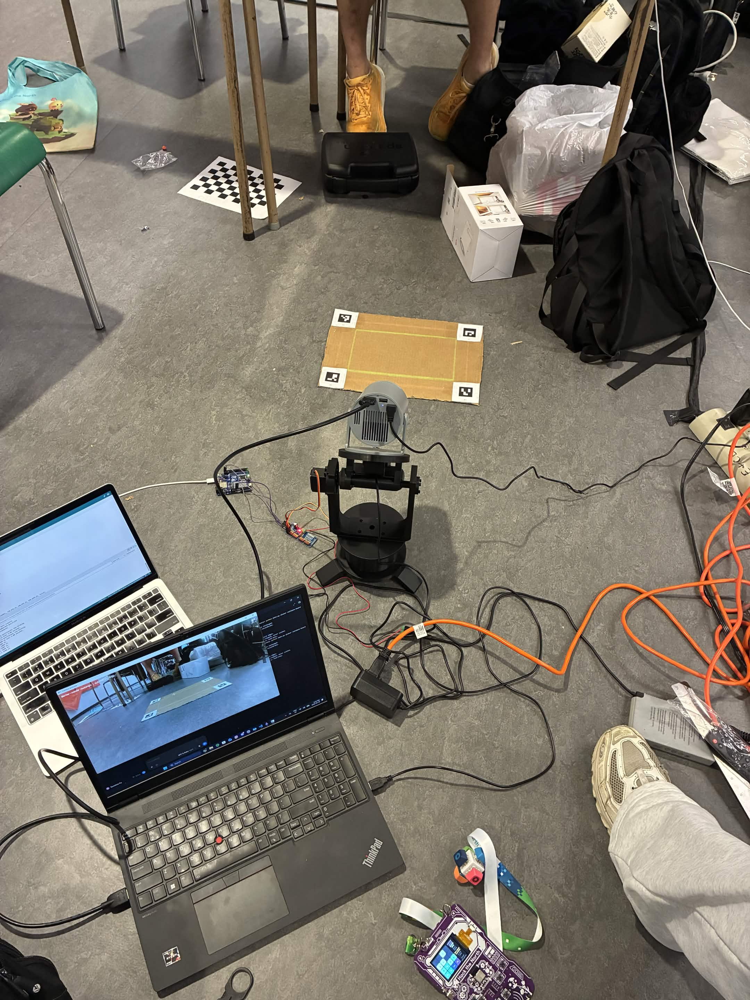
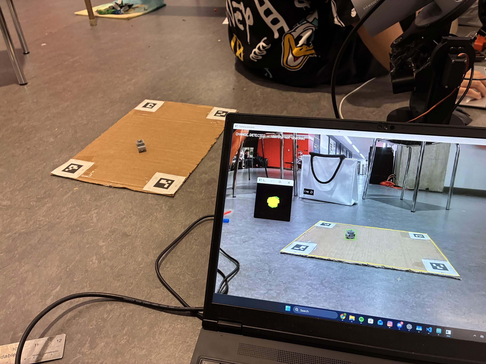
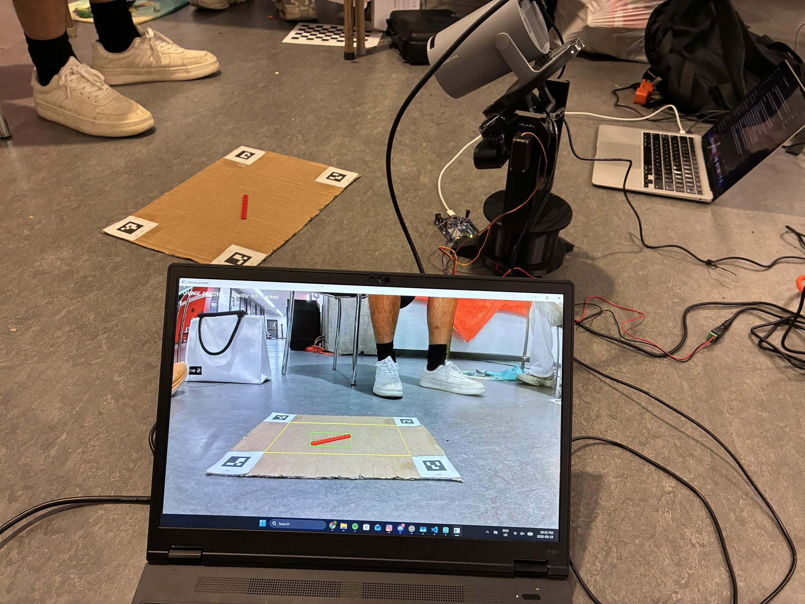
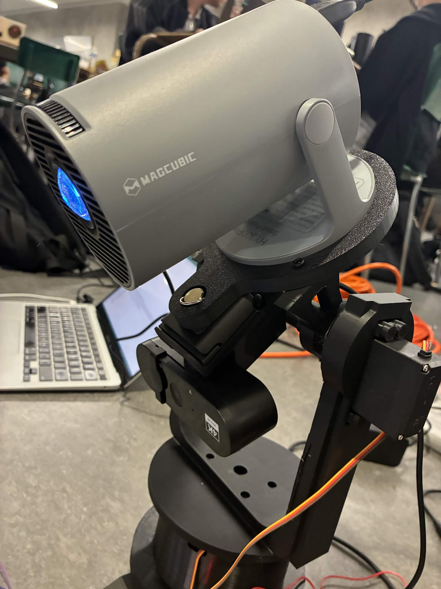

# Visionary

**Assembly instructions, projected onto the thing you're building.**

Built at **Hack the North**, Visionary turns a CAD assembly into physical placement guidance. A webcam watches the workspace, a projector highlights where the next component belongs, and computer vision checks the placement before you move on.

Our prototype uses LEGO, but the idea is broader: bring the information already inside a CAD model onto the workbench, where it can help someone build.



*An early placement test: a LEGO-sized footprint projected directly onto the workspace.*

## The idea

Following an assembly diagram means repeatedly looking away from the object and translating a drawing into a physical action. Visionary puts the next instruction on the object itself.

Place the first component, confirm its alignment, and the projector shows the next target. After you add a component and remove your hands, the system compares what the camera sees with what the CAD model predicts. It can accept the placement, suggest a correction, or report that there isn't enough visible evidence.

A marker attached to the assembly's base lets you slide or rotate the build to get a better view without starting registration over.

## How it works



1. **Read the design.** Fusion exporters provide component meshes, positions, orientations, colours, and a placement sequence with dependencies.
2. **Connect CAD to the workbench.** Fixed ArUco markers establish board coordinates. The first component anchors the CAD assembly, and a separate marker tracks its movable base.
3. **Project guidance.** A calibrated camera–projector model maps CAD points onto the physical workspace, including predicted surfaces above the board.
4. **Check the addition.** The camera detects new colour evidence. A depth-buffer renderer predicts which portions of the new component should remain visible behind installed parts, then compares nearby placement hypotheses.
5. **Continue the build.** An accepted step becomes the baseline for the next one. The user confirms advancement with Enter.

The active workflow uses **3D camera–projector calibration**. An earlier planar-homography mode remains available as a separate tool.

## What we built

- CAD-derived placement order, target geometry, and projected guidance.
- Camera and projector calibration with physical landing tests.
- ArUco tracking for a movable assembly base.
- Initial component recognition and anchor registration.
- Placement checking that accounts for occlusion by installed CAD components.
- Coordinate-labelled debug views and saved checks that can be replayed offline.
- An integrated CAD entry point with per-occurrence colour profiles and input validation.

Our physical prototype uses a small LEGO assembly with an engine block, a Technic brick, and two plates. In earlier board-plane tests, camera-measured projection errors were approximately **1–3.4 mm** across tested rig positions. Those measurements are not an independent ruler test or a guarantee of accuracy on raised surfaces.

Automated tests cover geometry, tracking, segmentation, projection, placement rejection, and diagnostic replay. They complement physical testing; they don't establish reliability for every assembly.

## From printed parts to projected guidance

These photos follow the hardware build and early projection and detection tests at Hack the North.

<table>
  <tr>
    <td width="50%"></td>
    <td width="50%"></td>
  </tr>
  <tr>
    <td><strong>Build the mount.</strong> Printed brackets, plates, and hardware form the camera–projector rig.</td>
    <td><strong>Pair the camera and projector.</strong> A shared mount keeps their relative geometry fixed for calibration.</td>
  </tr>
  <tr>
    <td></td>
    <td></td>
  </tr>
  <tr>
    <td><strong>Find the projection footprint.</strong> The full image extends beyond the cardboard; calibration uses dots that land on the usable flat surface.</td>
    <td><strong>Map the workspace.</strong> A projected outline provides a visual check of alignment inside the fixed ArUco markers.</td>
  </tr>
  <tr>
    <td></td>
    <td></td>
  </tr>
  <tr>
    <td><strong>Detect a new object.</strong> The camera highlights a grey component within the workspace.</td>
    <td><strong>Test another shape.</strong> A long red plate is detected in the same workspace.</td>
  </tr>
</table>

The detection photos show the early **change-detection stage**, with “identity not checked” on screen. They demonstrate finding newly placed objects, not completed CAD identity or assembly-placement verification.

<details>
<summary>Another view of the assembled hardware</summary>

<p align="center"></p>

The assembled rig includes a pan/tilt mechanism. The current assembly workflow keeps the head stationary; automatic servo aiming is not part of the demo loop.

</details>

## What makes the approach interesting

An early version tried to fit a complete, isolated STL silhouette to newly changed image pixels. When part of a component was hidden or missing from the colour mask, the fit could shift away from the correct location and suggest a misleading correction.

The current approach starts with **where the component should be**, predicts what the camera should actually see, and compares nearby alternatives. It can distinguish a clearly better displaced placement from a view that simply doesn't provide enough information.

The placement coordinates and sequence aren't hand-authored for each demo step: they come from CAD. The integrated path also reads colours from the export rather than looking up LEGO names. Shared tolerances and colour-detection settings remain configurable because CAD appearance and real camera images aren't identical.

## Current scope

Visionary is a hackathon prototype, not a general-purpose assembly inspection system. It currently assumes:

- A rigid assembly attached to a tracked base that stays flat on the board.
- One new component at a time, with previously accepted components staying in place.
- Heights and tilts matching the CAD model.
- Enough visible colour and shape evidence to compare placements.

It does not independently measure hidden connections, recognize hands, or recover arbitrary 3D object poses. Lighting, reflections, registration error, and occlusion can still make a correct placement uncertain. Strongly multicoloured or textured components need more work, and guidance does not yet fully account for objects blocking the projector's light.

## Built with

| Software | Hardware |
| --- | --- |
| Python, OpenCV and NumPy | Webcam and projector on a rigid mount |
| Autodesk Fusion API and STL meshes | Fixed ArUco board markers |
| Camera calibration, pose estimation and depth rendering | A separate ArUco marker on the assembly base |

The hardware workflow was developed on Windows. Pan/tilt firmware exists in the repository, but servo movement is not part of the assembly loop.

## Try it

A physical demo requires the camera, projector, marker board, and calibration for that hardware setup. Reusing calibration from unrelated hardware will not produce meaningful alignment.

```powershell
git clone https://github.com/terrencefu/Visionary.git
cd Visionary
conda env create --file environment.yml
conda activate hackthenorth
```

Export `assembly.json`, `toCV_output.json`, and the referenced STL meshes from the same Fusion design into one folder. The integrated command selects the first planned component as its anchor automatically.

Check the export and saved calibration without opening hardware:

```powershell
python main.py assemble --cad Fusion_output --check-only
```

Start the tracked-base workflow with our fixture's marker ID and size:

```powershell
python main.py assemble --cad Fusion_output --base-marker-id 5 --base-marker-size 30
```

**Controls:** Space captures the initial baseline; V checks a component; Enter confirms and advances after a successful check. Later baselines are captured automatically. M then Space provides recovery, B resets, and Q/Esc exits.

For setup details, calibration tools, older demo modes, and troubleshooting, see the [development and hardware notes](DEVELOPMENT.md). Those notes include historical settings; check the current configuration before using them.

## What's next

- Combine observations from multiple viewpoints as the user rotates the base.
- Improve colour robustness and support components with several surface colours.
- Refine registration using the growing assembly and detect parts slipping on the base.
- Add depth sensing to measure actual height and tilt.
- Account for projector occlusion and choose better inspection viewpoints.
- Consolidate the tools into a clearer application with explicit workflow states.

## Explore the code

| Directory | Purpose |
| --- | --- |
| `assembly/` | Fusion exporters, CAD plan handling, and assembly workflow |
| `perception/` | Marker tracking, change detection, colour profiles, and placement verification |
| `projection/` | Mapping guidance into projector pixels |
| `calibration/` | Camera/projector calibration and validation tools |
| `hardware/` | Camera/display interfaces and standalone servo firmware |
| `Fusion_output/` | Example assembly data and meshes |
| `tests/` | Automated tests |

Run the tests from the repository root:

```powershell
python -m unittest discover -s tests -q
```
